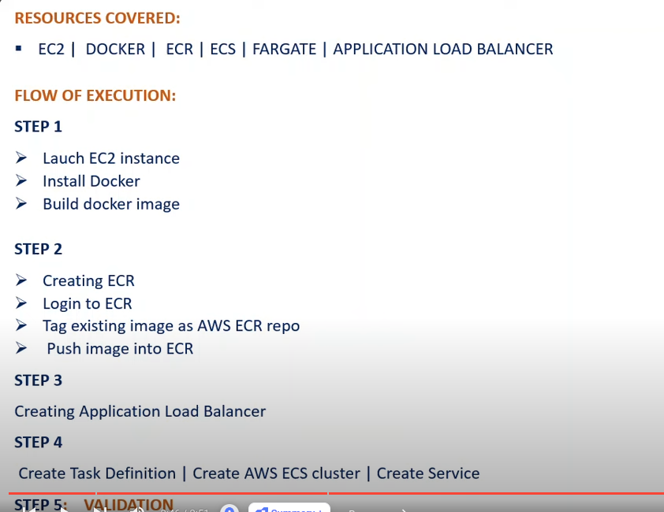

# Deploy an Application to Amazon ECS With EC2 | Docker | ECR | Fargate | Load balancer | AWS Project

youtube - https://www.youtube.com/watch?v=MpumO3TP8VY&list=PLqoUmUbJ_zDHPwK-ZWATXiYrUXwWkLY65&index=9

folder name inside ajay -containers-aws-ecs 

EC2 instance -

linux
key-value pair
netwrok setting edit
security-group-name - ec2-server-SG
security-group-descritpion - ec2-server-SG
add security group rule - type -HTTP/ source type - anywhere

after login into ec2 machine 
to isntall docker - https://docs.docker.com/engine/install/ubuntu/

chmod 400 "project-key-pair.pem"
ssh -i "project-key-pair.pem" ec2-user@ec2-65-0-18-146.ap-south-1.compute.amazonaws.com

sudo su
yum update -y
curl -fsSL https://get.docker.com -o get-docker.sh
yum install docker -y
docker --version
systemctl start docker
systemctl status docker
mkdir project
cd project
vim Dockerfile - paste docker file and save
vim index.html - paster index file and save - :wq!
ls
docker build -t project-image .
docker images
docker run -d -p 80:80 --name project-container project-image
docker ps

create elastic container registry

visibility setting - private ,
repo name

IAM role (ecr-role)- usecase - ec2 - adminisratoraccess attached policies
in user - create access key - access key & secreat key

inside ec2 machine - 

su - ec2-user

above command used to reach ec2 user - [ec2-user@ip-172-31-2-94 ~] from root user - [root@ip-172-31-2-94 ec2-user]# 

inside project directory run below command

aws configure 

create access key from iam user secret
AWS Access Key ID [****************O2CP]: 
AWS Secret Access Key [****************wPOS]: 
Default region name [us-east-1]: ap-south-1
Default output format [json]: 

view push command inside project direcotry inside ec2

1. aws ecr get-login-password --region ap-south-1 | docker login --username AWS --password-stdin 772943381465.dkr.ecr.ap-south-1.amazonaws.com

2. docker images

3. docker tag project-image:latest 772943381465.dkr.ecr.ap-south-1.amazonaws.com/project-repo:latest  # project-image   

4. docker images

5. docker push 772943381465.dkr.ecr.ap-south-1.amazonaws.com/project-repo:latest

check image in ecr

Create an Application Load Balancer in AWS EC2

ec2 -> load balancer 
load balancer type -> application load balancer

internet facing

availability zone select 3 

security group - ec2-server1-SG

Listner target group ->traget group name -> advanced health check setting -> health threshold -> 2 then next and then create load blancer

select target group name

create load balancer

Create Task Definition, Cluster and Service in Amazon ECS | Using Load Balancer in ECS & Validation

ecs is a higly scalable and fast container management service that makes it easy to run, stop, and manage containers on a cluster.

1. Task definiation 

create new task deifination
task definiantion name -
container1

name - ecs-container1 , image url - ecr uri

task execution role - 
   IAM - role (ECS Task execution -role )-use case- elastic container service task - AmazonECSTaskExecutionRolePolicy

2. ECS cluster

clsuter name -
subnet -a1,b1,c1

3. Service
go inside cluster
compute options - Capacity provider strategy 
development configuration - family - ecr-task-def 
service name -
desired task - 2
networking - subnets - a1,b1,c1
security group - create new security group 
security group name - my-ecs-sg
security group descritpion - my-ecs-sg
Inboud rule - Type- HTTP, Source - Anywhere
Load balacner- application load balancer
application load balancer - use an existing load balacner
Target group - create a new target group 
   target group name - service-TG
   path pattern - /*
   evalution order - 1

Listner - use an existing listner

now create service

now go to ecs cluster - service and then task 

go to task

go to service - networking -> dns name

copy dns name and paste in to the brower -> ecs containeried application is running, ecs is helping to manage our docker container,
our application is running inside container , we have pointed a load balancer because we have task running it look this load balancer can help us to balance the traffic between these two task in our service so with that we have high availability in case something happen in one availablity zone it can actually fail over to another so this is the good configuration 

inside service - total 2 targets that you can see inside ec2

