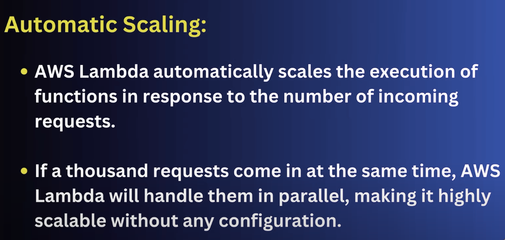

# Computing services
ec2 - elastic cloud computing
lambda - (serverless service)

# storage
s3 - simple storage service

# database services
RDS (relational database service)
Athena - (serverless)

# NoSQL database
AWS Dynamo (Key value type of db)

# Data Warehousing
Redshift (very popular)

# Analytics 
EMR (Elastic map reduce)
Glue (distributed)
Kinesis (Streaming)
SQS (simple queue service)
Quick sight (Dashboarding)

# Monitoring & Scheduling
cloudwatch

# Notification
SNS (Simple notification) 

# Access Management 
IAM (Identity access management)

# 1. S3 - simple storage service

we can do copy settings from other bucket while creating bucket
block all pubic access
bucket versioning - to upload same file with more new records then it will keep maintain version of each file
tags - like environment -dev
defualt encryption - encryption key, bucket key

in s3 bucket everything is an object

s3 objects - uploaded or created data files

s3uri - universal resource identifier

s3://test_bucket/employee_folder/employee.csv

how s3 will be able to identiy a unique object inside unique object inside the s3  -  by key -> prefix + object_name
                                                                                 key -  (employee_folder + employee.csv)

ARN - Amazon resource name
when two aws services want to interect from each other we have to use ARN
arn:aws:s3:::test_bucket/employee_folder/employee.csv

suppose-  aws emr(spark)  and s3 (test_bucket/employee_folder/employee.csv) 

spark cluster want to read file from s3 then we have to implement arn 

we have to apply bucket policies which other servies (emr,lambda) can access this bucket

command - python3.10 -m pip install boto3

we have archiving facility - bucket -> permissions -> Intelligent-Tiering Archive configurations

- Archive Access tier
When enabled, Intelligent-Tiering will automatically move objects that haven’t been accessed for a minimum of 90 days to the Archive Access tier.

- Deep Archive Access tier
When enabled, Intelligent-Tiering will automatically move objects that haven’t been accessed for a minimum of 180 days to the Deep Archive Access tier.

https://ap-south-1.console.aws.amazon.com/s3/buckets/local-ingest-bucket?region=ap-south-1&bucketType=general&tab=objects

# 2. EC2 -elastic cloud computing

its a virtual machine which have operating machine , memory,cpu

it is a virtual server on the cloud

-   Appication and OS Machine (Amazon Machine Image) - amazon linux, macos, ubuntu, windows 
-   Amazon Machine Image(AMI)

- instance type - example - 1cpu 8gb ram , 500gb hard disk 

- key value pair to login from ssh into ec2 machine

- network setting

vpc -, ranges, subnet, security group, IP

- ssh - allow from any machine to access that virula machine - from any ip , or custom or my ip
-configure storage

ssh

chmod 400 pem.pem

chmod 400 "ec2_rds.pem"
ssh -i "ec2_rds.pem" ec2-user@ec2-13-233-110-200.ap-south-1.compute.amazonaws.com

ls
pwd

# 3. Lambda 

It is light weighted serverless serivce
No infra setup is needed

Ex. api development

author from scretch, use a bluepoints, use container
create role

manual trigger - name - lambda_trigger

name - test_lambda_function

https://ap-south-1.console.aws.amazon.com/lambda/home?region=ap-south-1#/functions/test_lambda_function?newFunction=true&tab=code

connect lambda to s3

lambda layer - it helps to install libracies and pakcages 

tyes of layer - aws layer, custom layer, speicfy an ARN

s3 event notification -
lambda_s3_event - All object create events, All object removal events
employee_data/
Lambda function
test_lambda_function 

-----------------

function - lambda_handler

event, deploy, test

trigger - s3, api gateway, alexa, dynamodb,cloud watch

event type - put , post, create , delete

we can upload zip file of python code

# 4. IAM (Identity access management)

To restrict the service access
when two services in the aws want to comunicate with each other then we need to declare few policies, which will act like a agreement.

IAM users -different logis for each user
IAM Role - contains polices to access aws resources

iam role -read,write,update,delete aws resources
policies

we have to create role and allow attach 's3fullaccess' policy to connect lambda to s3

iam role - 'lambda-to-s3'
policies - 
1. inline plicy->read-from-s3-inline-policy (s3-> get,list, select resource bucket)
2. attached policy-> AWSLambdaBasicExecutionRole

then in configuration of lambda we have to attached iam role

now check in cloudwatch

lambda -s3 -> trigger lambda by s3 event notification, put,post

for event notification from s3
to get obejcts data- add inside inline policy resource: 

Resource": [
                "arn:aws:s3:::local-ingest-bucket",
                "arn:aws:s3:::local-ingest-bucket/*"
            ]   

# 4. Coludwatch
CloudWatch observability solutions out-of-the-box observability for AWS services and popular workloads. These ready-to-use, customizable solutions are designed to get you up and running quickly with monitoring at AWS.

Create alarms - Set alarms on any of your metrics to receive notification when your metric crosses your specified threshold.
Create a default dashboard - Create and name any CloudWatch dashboard CloudWatch-Default to display it here.
View logs - Monitor using your existing system, application and custom log files.
View events - Write rules to indicate which events are of interest to your application and what automated action to take.

Reliable observability solutions tailored to specific workloads and use cases.
Available in Amazon native and open-source platforms.
Simplify the process of instrumenting and gaining insights into your workloads.

Set up monitors and dashboards to detect issues and resolve problems with enterprise applications, databases, and workloads.

# 5. SNS - Simple Notification Service

It works with the push model

suppose upload note to s3 it publish notification to sns and then it sns topic push this notification to every direction who subribe it.

- we can create multiple topics
- message / event will be publish in this topics
- subcribers will subcribes the topic
- SNS will broadcast these message

topic type - FIFO,standard

s3 event notification - select SNS service and attach sns topic to get notification if any file insert,update or delete in s3

- create SNS topic and create subcriber and then publish message , we will get msg in mail

Amazon SNS is a highly available, durable, secure, fully managed pub/sub messaging service that enables you to decouple microservices, distributed systems, and event-driven serverless applications. Amazon SNS provides topics for high-throughput, push-based, many-to-many messaging.

creating sns topic -

topic name - 'sns-test-tpoic'

topic type -
1. FIFO - Strictly-preserved message ordering
Exactly-once message delivery
High throughput, up to 300 publishes/second
Subscription protocols: SQS

2. Standard
Best-effort message ordering
At-least once message delivery
Highest throughput in publishes/second
Subscription protocols: SQS, Lambda, HTTP, SMS, email, mobile application endpoints

Access policies - basic,advance

everyone

Delivery policy - no. of retires and time takento deliver msg

Topic ARN - 'arn:aws:sns:ap-south-1:772943381465:sns-test-tpoic'

type of protocol to subribe - Email , SMS, SQS, Lambda, Kinesis, HTTP, HTTPS, Platform application endpoint

now from s3 - event notification - create - 'sns-event' , destination type - SNS Topic and 
destination - 'sns-topic' 
event type - All object create events, All object removal events

sns_lambda.py

# 6. RDS - relational database service

database creation method - standard create, easy create

engine type - mysql,postgres sql,mariadb, oracle, sql server

db instance - production, dev/test, free tier

instancce name - 'test-db
username - admin
password - Ajaykumar95

Connected compute resources

# connect rds with ec2 
go to action of rds -> ec2 connect
 then follow below process on cmd

## to conenct rds with local machine follow -
https://repost.aws/knowledge-center/rds-connect-ec2-bastion-host

1. ssh -i "YOUR_EC2_KEY" -L LOCAL_PORT:RDS_ENDPOINT:REMOTE_PORT EC2_USER@EC2_HOST -N -f
   ssh -i "ec2_rds.pem" -L 3342:test-db.c1wou86u4fgm.ap-south-1.rds.amazonaws.com:3306 ec2-user@ec2-13-201-94-232.ap-south-1.compute.amazonaws.com -N -f

2. lsof -i4 -P | grep -i "listen" | grep LOCAL_PORT
   lsof -i4 -P | grep -i "listen" | grep 3342

3. nc -zv 127.0.0.1 LOCAL_PORT
   nc -zv 127.0.0.1 3342

4. mysql -h 127.0.0.1 -P LOCAL_PORT -u RDS_USER -p
   mysql -h 127.0.0.1 -P 3342 -u admin -p

for ec2->  ssh -i "ec2_rds.pem" ec2-user@ec2-13-201-94-232.ap-south-1.compute.amazonaws.com

inside mysql
> show databases;
> create database test;

# 7. EMR

emr is build on ec2 machine

emr cluster name - 
emr version - 6.9
application bundle -spark, core hadoop, hbase, presto, custom

custom - hbase, hadoop, spark, hue, hcatalog, hive

Hbase file system -HDFS

amazon linux release

cluster configuration - Instance group

primary node -(master) - manage cluster by running software components, distribution of task and data
core node -(Name node) -  perform task and store data in hdfs
task (worker node) - perform task but did not store in hdfs

task node will support core node to perform task

1 core , 1task

cluster termination - manual or terminate after idle time

Amazon EMR service role -  emr_default_role, emr_ec2_default

hadoop is the user in case of emr and endpoint - ec2-15-206-203-143.ap-south-1.compute.amazonaws.com

ssh -i "ec2_rds.pem" hadoop@ec2-3-108-63-106.ap-south-1.compute.amazonaws.com

$ hadoop fs -ls /
$ hadoop fs -mkdir /input
$ hadoop fs -ls /

hive
$ hive
> show databases;
> create database test;

$ pyspark
> 

$ vim pyspark_test.py

#necessary libraries of pyspark
from pyspark.sql import SparkSession
from pyspark.sql.types import StructType,StructField, StringType, IntegerType

spark = SparkSession.builder.appName("demoApp").getOrCreate()

#Create list of data to prepare data frame
person_list = [("Berry","","Allen",1,"M"),
    ("Oliver","Queen","",2,"M"),
    ("Robert","","Williams",3,"M"),
    ("Tony","","Stark",4,"F"),
    ("Rajiv","Mary","Kumar",5,"F")
]   

#defining schema for dataset
schema = StructType([ \
    StructField("firstname",StringType(),True), \
    StructField("middlename",StringType(),True), \
    StructField("lastname",StringType(),True), \
    StructField("id", IntegerType(), True), \
    StructField("gender", StringType(), True), \
])  
    
#creating spark dataframe
df = spark.createDataFrame(data=person_list,schema=schema)

#Printing data frame schema
df.printSchema()

#Printing data
df.show(truncate=False)

#Writing file in hadoop
df.write.csv("/output/record.csv")

# spark submit command
spark-submit --master yarn --deploy-mode cluster pyspark_test.py

hadoop fs -ls /

hadoop fs -ls /output

hadoop fs -ls /output/record.csv

# 8. AWS Glue

it is  a serverless service use for  move and prepare data for analytics & machine learning

first create - 1. crawler , s3 bucket 

crawl all sub folder

-2. glue job 

in glue job role - glue job was reading data from data catalog itself

s3fullaccess
glue metadata access
cloudwatch

-3. glue trigger

trigger type - on demand, schedule, job on crawler run

-4.glue workflow

crwaler - trigger type- event bridge event - 1
glue job - trigger type - Event
            trigger logic - start after any watched event

metadata will store in temporary path in s3

# 9 . AWS EventBridge

attached glue workflow with event bridge for scheduleing workflow

event bridge rule- 

rule type - schedule

aws service
glue workfow name

create new role and attach below policy
1.CloudWatchEventsBuiltInTargetExecutionAccess  
2.CloudWatchEventsInvocationAccess policies

in glue workflow we have set max concurrency -1 

# 10. Athena - serverless service
interactive query service that makes easy to analyse the data in amazon s3 
and other featured data source using SQL

set path for output in setting

it is used for data analysis

we can create table from glue crawler, s3 bucket, create table, create table as select, create view

from s3 bucekt- 

table type - apache hive
file format - apache parquet

serde libary - default

we can create view as well 

athena stores the table schema in aws glue catalog

# 11. Redshift

dataware- we are duming transform data into datawarehosue  space and we are analysing it

it is cloud based data warehousing service

snowflake- enterprice level datawarehosueing servies

redshift follow master slave architecture

it is for datawarehosueing purpose

# load the data from s3 to redshift

CREATE TABLE employee_data (
    employee_id INT,
    employee_name VARCHAR(50),
    salary DECIMAL(10, 2),
    join_date DATE
);

COPY table_name
FROM 's3://your-bucket-name/your-folder/'
IAM_ROLE 'arn:aws:iam::account-id:role/RedshiftS3Role'
FORMAT AS CSV
DELIMITER ','
IGNOREHEADER 1;

IAM Role: Attach an IAM role to the Redshift cluster with AmazonS3ReadOnlyAccess or a custom policy allowing access to the specific S3 bucket.

GT TDS Analytics - (Client- Grant Thornton):
Project Summary: Grant Thornton emphasizes the integration of data analytics and
visualization in tax departments to empower tax professionals by enabling them to uncover
insights and make informed decisions. An agile tax department, utilizing analytics and
visualization, enhances decision-making, improves productivity, reduces risk, and drives
greater value for the organization. This approach not only aids in tax but also offers business
intelligence, uncovering insights in areas like purchasing trends, inefficiencies, process
improvements, and financial analysis across various scenarios.
Technologies Used: SQL, Snowflake, AWS, PySpark, Snowpark, Pandas, Numpy, PowerBI.

# 12. AWSECS - (Elastic Container service)
It is the cloud based container management service that allows you to run and manage docker containers on a cluster of virtual servers. 

Why ECS?

It automatically handles
Creation
Management 
Updating

create aws ecs -
cluster name - MyCluster
Infrastructure - AWS Fargate, Amazon EC2 Instances

Task definitions - create task - 
Infrastructure - AWS Fargate, Amazon EC2 Instances
OS architecture, Network Mode - 
os - Linux
network mode - awsvpc(default)
task size - .5cpu , memory - 1gb

container1 -
nginx - image url - nginx:latest
port service- 80
resource allocation - 
logs - enabled

go to cluster then create service

create service -

compute options - launch type
launch type -  FARGATE

deployment configuration - Family - MyTask
service name - MyService
Service type  - Replica
Desired task - 2
Networking - create a new security group - inbound rule - type - HTTP, source - anywhere
pubic ip - enabled

now create

and then go to task and it will start running automatically

then go to task and networking and pulic url

we can update service as well,

force delete service, deregister task, delete cluster

# 13. ECR - Elastic Container Registry
ECR is a fully managed docker container registry that makes it easy to store, manage, and deploy docker container images.
it is seamlessly integrates with other aws services and provides secure,scalable storage for your container images.
ECR offer both public and private repositories 

connected to aws cli-

sudo apt install awscli
aws --version
aws configure

create access key from iam user secret
AWS Access Key ID [****************O2CP]: 
AWS Secret Access Key [****************wPOS]: 
Default region name [us-east-1]: ap-south-1
Default output format [json]: 

aws s3 ls

inside ecr we keep docker image of code and inside ecs we run docker image inside that ecs container
https://www.digitalocean.com/community/tutorials/how-to-install-and-use-docker-on-ubuntu-20-04

Install AWS CLI on your local machine.
Configure AWS CLI using the below command: aws configure
Create an AWS ECR repository
Read the Push commands
Get a dockerized application to push the docker image on AWS ECR.
Once the image is pushed to ECR it can viewed on AWS ECR.
Yay! you pushed a docker image on AWS ECR

install docker desktop for ubuntu 20.04 - 
https://www.digitalocean.com/community/tutorials/how-to-install-and-use-docker-on-ubuntu-20-04

push command in ecr

folder name inside ajay - SpringBootH2Project folder

zec@zec-HP-EliteBook-840-G3:~/Documents/Ajay/SpringBootH2Project$ 

1. aws ecr get-login-password --region ap-south-1 | docker login --username AWS --password-stdin 772943381465.dkr.ecr.ap-south-1.amazonaws.com

2. docker build -t testrepo .

3. docker tag testrepo:latest 772943381465.dkr.ecr.ap-south-1.amazonaws.com/testrepo:latest

4. docker push 772943381465.dkr.ecr.ap-south-1.amazonaws.com/testrepo:latest

# 14.AWS EKS 

eks tutorial - https://www.youtube.com/watch?v=1lZdI8BInWc&list=PLuVrvwRQWy6QQDBe11vKD-haZZr7MLvPB&index=1&pp=iAQB
               https://k21academy.com/docker-kubernetes/amazon-eks-kubernetes-on-aws/

1. create eks clsuter

2. IAM role(eksClusterRole) - use case - EKS - eks cluster 

3. create EC2 instance

4. create access key

5. ec2 instance connect
      aws --version
      eksctl
      sudo eksctl
      sudo kubectl

      aws configure
         create access key from iam user secret
         AWS Access Key ID [****************O2CP]: 
         AWS Secret Access Key [****************wPOS]: 
         Default region name [us-east-1]: ap-south-1
         Default output format [json]: 

      check status of cluster
      aws eks --region ap-south-1 describe-cluster --name k21eks01 --query cluster.status
      pwd
      ls -a
      cd .aws
      ls
      ls -al
      cat credentails
      cat config
      cd ..
      ls
      cd
      ls
      ls -a
      aws eks --region ap-south-1 update-kubeconfig --name k21eks01
      cd .kube/
      ls
      cat config
      ls
      cd ..
      ls
      ls -a
      kubectl get svc

      install kubectl - https://docs.aws.amazon.com/eks/latest/userguide/install-kubectl.html

      inside [ec2-user@ip ~] curl -O https://s3.us-west-2.amazonaws.com/amazon-eks/1.31.2/2024-11-15/bin/linux/amd64/kubectl

      ls -a
      ls -a
      ls -al

      chmod +x ./kubectl
      mkdir -p $HOME/bin && cp ./kubectl $HOME/bin/kubectl && export PATH=$HOME/bin:$PATH
      ls
      cd bin
      ls -la
      echo $PATH
      kubectl version --short --client
      kubectl version --client

      cd
      ls -a
      ls -a

      <!-- # for ARM systems, set ARCH to: `arm64`, `armv6` or `armv7`
      ARCH=amd64
      PLATFORM=$(uname -s)_$ARCH

      curl -sLO "https://github.com/eksctl-io/eksctl/releases/latest/download/eksctl_$PLATFORM.tar.gz"

      # (Optional) Verify checksum
      curl -sL "https://github.com/eksctl-io/eksctl/releases/latest/download/eksctl_checksums.txt" | grep $PLATFORM | sha256sum --check

      tar -xzf eksctl_$PLATFORM.tar.gz -C /tmp && rm eksctl_$PLATFORM.tar.gz -->

      curl -sLO "https://github.com/eksctl-io/eksctl/releases/latest/download/eksctl_$(uname -s)_amd64.tar.gz" | tar xz -C /tmp
      ls
      cd /tmp/
      ls -ltr
      cd
      sudo mv /tmp/eksctl /usr/local/bin
      echo $PATH
      cd /usr/local/bin/
      ls -al
   then select role in node group
   node group scalig configuraton - 2,2,2

now create node group

now run inside -> [ec2@ip ~] kubectl get nodes --watch
now run inside -> [ec2@ip ~] kubectl get nodes

7. Delete EKS Cluster from Console

cluster -> node group -> delete 

      
delete all EKS roles      

# 15. VPC - Virtual private cloud

What is VPC
What are subnets
What is AWS region and availability zones
What is CIDR Block
What are routing tables
Integrating Internet Gateways (IGW)
What is NAT
What is Security Group
Managing Security Groups
VPC Peering
AWS Client VPN
AWS Direct 
Bastion Host
Real-world examples and usecases

A private, isolated network within the aws cloud where you can launch and manage your resources securely.  

why we need VPC?
to secure isolated and control network environments.

in one region -> multiple Availability zones a1,b1,c1 to prevent failure of one Availability zone

while creating vpc we were providing CIDR range

CIDR - (classless inter-domain-routing) is a method for allocating IP addresses and routing internal protocol(IP) pocket.

cidr.xyz to understand cidr

10.0.0.0/16 

if ipv4 cidr block 16 - 65536
if 28 - 16

first usable ip - 10.0.0.1
last usable ip - 10.0.255.254

one region -> one VPC -> we can have 16 ip or 65536 inside VPC

Subnet - a subnet is a smaller, segment part of a larger network that isolated and organizes device within a specific IP address range.

public-subnet -front end - 10.0.1.0/24
private-subnet - database - 10.0.2.0/24

each of subnet have 256 ip in which 251 is usable

subnet build on avaliability zones 

in one avaliability zone you can build mutiple subnet or 
one avaliability zone one subnet

inside aws--->

vpc setting -> vpc and more 

ipv4cidr block - 10.0.0.0/16

number of avaliability zones - 2,3 - a1,b1,c1

number of private and public subnet

each subnet inside VPC accociated with a route table,  which controls the routing for the subnet

Internet gateway -> Internet gateway is a component that allows communication between instances in your VPC and internet.
 (we can see it is conencted with VPC)

Security group -> Network firewall rules that control inbound and outbound traffic for instances.

(Only allow rules)
security group work on instance level

inside VPC -> security group -> open security group -> inbound rule (from internetor browser request will come in ur application- enable HTTP/port 80)

Netwrok ACLs (Access control lists): -> optional layer of your VPC that acts as a firewall for controlling traffic in and out of one or more subnets.

Allow or deny rules.

Networks ACL works on Subnet (one or more subnet) - (one subnet can have multiple instance) 

NAT - (Network Address Trnaslation) Gateway: -> Enable instance in private subnet to conenct to the internet or other AWS services, but prevents the internet from initiating connections to those instances.

VPC Peering -> a networking connection between two vpc's that enables you to route traffic between them privately.

VPC endpoints -> allow you to privately connect your vpc to supported AWS services and VPC endpoint services powered by aws privatelink.

ex. connection between ec2 instance to s3 

Bastion Host -> A special-purpose instance that provides secure access to your instance in private subnets.

Elastic IP Address -> Static IP addresses designed for dynamic cloud computing.

VPC Flow Logs -> Capture infromation about the IP traffic going and from network interfaces in your VPC.

Direct conenct -> establishes a dedicated netwrok connection from your premises to AWS.

AWS Client VPN -> Managed VPN service that enables secure remote access to AWS resources and on premises netwroks using OpenVPN-based clients.

# 16. API Gateway

Create, Maintain, and secure API's at any scale  

Amazon API Gateway helps developers to create and manage APIs to back-end systems running on Amazon EC2, AWS Lambda, or any publicly addressable web service. With Amazon API Gateway, you can generate custom client SDKs for your APIs, to connect your back-end systems to mobile, web, and server applications or services.

Choose an API type

1. HTTP API
Build low-latency and cost-effective REST APIs with built-in features such as OIDC and OAuth2, and native CORS support.
Works with the following:
Lambda, HTTP backends

2. WebSocket API
Build a WebSocket API using persistent connections for real-time use cases such as chat applications or dashboards.
Works with the following:
Lambda, HTTP, AWS Services

3. REST API
Develop a REST API where you gain complete control over the request and response along with API management capabilities.
Works with the following:
Lambda, HTTP, AWS Services

4. REST API Private
Create a REST API that is only accessible from within a VPC.
Works with the following:
Lambda, HTTP, AWS Services

create api_gateway ->
   rest_api public -> 
   protocol - rest
   create new api - example api
   enpoint -regional
   import

resource -> Action -> Deploy API 
                        development stagee -new stage
                        stage name -
                        deploy and then click on url

                        niche aane ke bad mapping template -text/html - change and save and then again - deploy api - second stg

https://www.youtube.com/watch?v=OtRD1zsszQI

cretae new api -> create resource -> enable api gateway cors

click on resource -> create method -post -> intergatrtion run time -> lambda -> cretae lambda function -> trigger

then select lambda function

then create deploy API -> stage

paste url link in postman -> post - URL/resource_name -> raw -> json -{"test":"Hii"}

go to lambda function -> monitor -> coludwatch log -> generated log

API gateway is a microservice

# 17. Step Function

we invoke lambda function with the help of step function

in lambad function trigger json
1st lambda

ex. {"time":4}

2nd lambda

ex. {"place":"office"}

1st lambda function ka output will work as input for 2nd lambda function

now create step function -> invoke lambda -> choose lambda function1 -> then next -> next -> create role -> create function 
                         -> execute function -> in json -> {"time":4} -> start exectution -> 

                         then edit state machine -> workflow studio -> lambda invoke -> 
                         choose lambda function2 -> apply and exit -> save -> save anyway -> start execution -> in josn {"time":4}
                         -> start execution and check both function

create new step function -> with type - choice with json 

# 18. AWS CodePipeline

The easiest way to create a pipeline is to use the Create pipeline wizard in the AWS CodePipeline console.

# Tutorial: Create a simple pipeline (S3 bucket)

https://docs.aws.amazon.com/codepipeline/latest/userguide/tutorials-simple-s3.html

Step 1: Create an S3 source bucket for your application

create s3 and enable versioning  
upload - SampleApp_Linux.zip

Step 2: Create Amazon EC2 Linux instances and install the CodeDeploy agent

https://docs.aws.amazon.com/codepipeline/latest/userguide/tutorials-simple-codecommit.html#codecommit-create-deployment

https://docs.aws.amazon.com/codepipeline/latest/userguide/tutorials-simple-s3.html#s3-add-stage-part-2

# Define CI/CD pipelines with stages and actions

https://docs.aws.amazon.com/codepipeline/latest/userguide/pipelines.html

# Create a pipeline, stages, and actions

https://docs.aws.amazon.com/codepipeline/latest/userguide/pipelines-create.html

aws codepipeline start-pipeline-execution --name MyFirstPipeline-ajay

aws codepipeline get-pipeline --name "MyFirstPipeline-ajay1"
aws codepipeline get-pipeline --name MyFirstPipeline-ajay >pipeline.json

aws codepipeline get-pipeline --name "MyFirstPipeline"

-------------------------------------
# Tutorial: Create a simple pipeline (CodeCommit repository)

https://docs.aws.amazon.com/codepipeline/latest/userguide/tutorials-simple-codecommit.html#codecommit-create-deployment

https://osusarak.medium.com/ci-cd-with-aws-codepipeline-d8d0538a52f2

# AWS CodeDeploy with CodePipeline // Complete CICD Project for DevOps Engineers (Hindi)

Youtube - https://www.youtube.com/watch?v=IUF-pfbYGvg&list=PLlfy9GnSVerRwvzoRKor9txxfPq9c8FWE&index=3

blog- https://www.trainwithshubham.com/blog/setting-up-aws-codedeploy-agent-on-ubuntu-ec2

# 19. AWS Secrets Manager 

AWS Secrets Manager helps you protect access to your applications, services and IT resources. You can easily rotate, manage and retrieve database credentials, API keys and other secrets throughout their lifecycles.

Use Secrets Manager to store, rotate, monitor and control access to secrets such as database credentials, API keys and OAuth tokens. Enable secret rotation using built-in integration for MySQL, PostgreSQL and Amazon Aurora on Amazon RDS. You can also enable rotation for other secrets using AWS Lambda functions. 

https://docs.aws.amazon.com/secretsmanager/latest/userguide/hardcoded.html

create secret manager , then run below command

aws secretsmanager get-secret-value  --secret-id My_Test_secret/SSH

then go to rds instnce then create new and save credentials

then go to aws secret manager then choose rds then enter credentials

automatic rotation of configurations

cloud trail to check who have tried to retrive or access that account

now you can set alert message with the help of cloud watch -> rule -> cofigure lambad function to sent sns notification

1. aws configure

2. aws secretsmanager get-secret-value --secret-id "dev/app/mysql" --region ap-south-1

AWS Secrets Manager features
1. Secure secrets storage
2. Automatic secrets rotation without disrupting applications
3. Automatic replication of secrets to multiple AWS Regions
4. Programmatic retrieval of secrets
5. Audit and monitor secrets usage
6. Compliance
7. Secrets Manager Integration

permission - 

SecretsManagerReadWrite
IAMFullAccess

How Does AWS Secrets Manager Keep My Secrets Secure?
AWS Secrets Manager encrypts at rest using encryption keys that we own and store in AWS Key Management Service (KMS). We can control access to the secret using AWS Identity and Access Management (IAM) policies. When we retrieve a secret, Secrets Manager decrypts the secret and transmits it securely over TLS to our local environment. By default, Secrets Manager does not write or cache the secret to persistent storage.

How Can My Application Use These Secrets?
AWS Identity and Access Management (IAM) policy permits our application to access specific secrets. Then, in the application source code, we can replace secrets in plain text with code to retrieve these secrets programmatically using the Secrets Manager APIs.   

What Happens When I Rotate My Secret?
When a secret is rotated, a new version of its value becomes available for use. You can choose to manually add a value or automatically generate one at regular intervals by enabling automatic rotation.
-------------------------------------
Terraform -  
initialize, plan & apply

terraform init
terraform plan
terraform apply/destroy